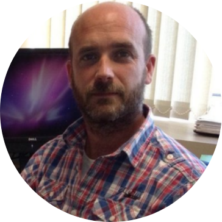

\  

## Teaching team

\  

#### Alex Douglas
<div style= "float:left;position: relative; top: 5px;">
```{r, out.width = "200px", out.extra='style="padding:30px;"', echo = FALSE}

```
</div>

\ 

Alex is a Professor of Biostatistics at the University of Aberdeen and has been teaching (and learning) R since version 2.1. 

- Email: a(dot)douglas(at)abdn(dot)ac(dot)uk
- Web: https://www.abdn.ac.uk/people/a.douglas/
- X: https://twitter.com/Scedacity
- GitHub: https://github.com/alexd106

\  

\  

#### Deon Roos
<div style= "float:left;position: relative; top: 5px;">
```{r, out.width = "200px", out.extra='style="padding:30px;"', echo = FALSE}
knitr::include_graphics("images/deon.png")
```
</div>

\ 

Deon is a Lecturer in Applied Statistics at the University of Aberdeen and has been using and teaching R for the last 10 years. 

- Email: deon(dot)roos4(at)abdn(dot)ac(dot)uk
- Web: https://www.abdn.ac.uk/people/deon.roos4
- X: https://twitter.com/DeonRoos88
- GitHub: https://github.com/DeonRoos
\  


